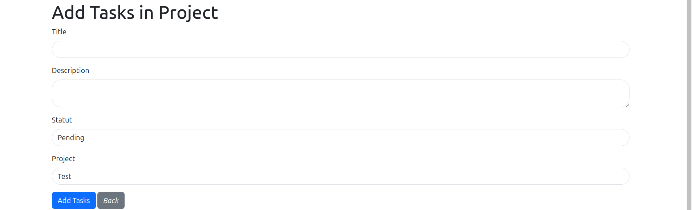

# gestion_project
# Titre Du TP 
    Gestionnaire de projets

# Details Du projet
    Une NavBar
    Deux Models(Task,Project)
    Deux Controllers(Taskcontroller,ProjectController)
    Deux Factories (ProjectFactory,TaskFactory)
    Deux Seeders(ProjectSeeder,TaskSeeder)
    les deux pour genrer des donnes en utilisant la commande suivante
    php artisan db:seed

# Captures D'ecrants

# NavBar

# Formulaire de project

# Formulaire de task

# Edit Formulaire Project

# Edit Formulaire task

# Ui project sans la nav

# ui task sans la nav

# footer

# ui final

# Installation

git clone https://github.com/djiawou/gestion_project.git

cd gestion_project

# Installation des dependences
composer install

# Faire les migrations
php artisan db:seed
php artisan migrate

# Demarrer le serveur
php artisan serve
